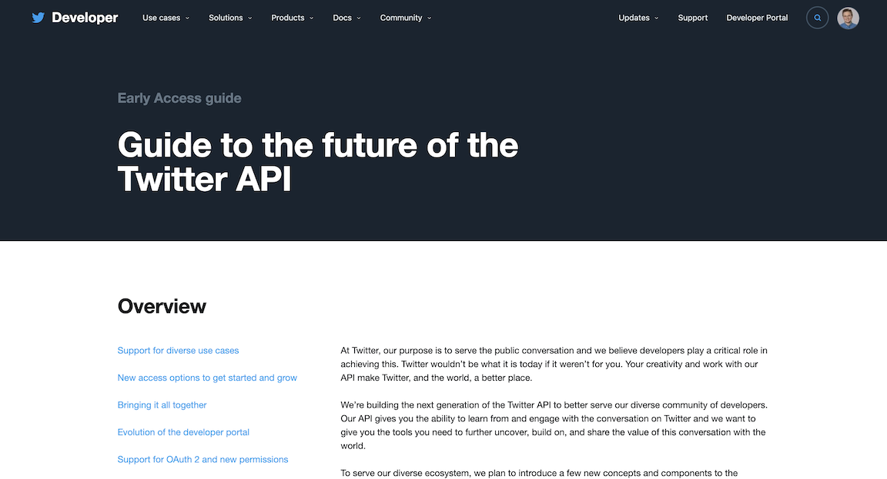

# hydrate-tweets-api-v2

<br />
<p align="center">
  <h1 align="center">Tweet Hydrator, Developer API v2</h1>
  <p align="center">
    Hydrate tweets given a list of tweet IDs using the new Twitter Developer API version 2.
    <br />
  </p>
</p>

<!-- TABLE OF CONTENTS -->
## Table of Contents

* [About the Project](#about-the-project)
* [Getting Started](#getting-started)
  * [Prerequisites](#prerequisites)
  * [Installation](#installation)
* [Usage](#usage)
* [License](#license)
* [Contact](#contact)
* [Acknowledgements](#acknowledgements)

<!-- ABOUT THE PROJECT -->
## About The Project

This project provides a module, `tdv2`, which provides an easy way to access the Twitter Developer API v2 using Python.

This project is in its very early stages. Check back in for updates soon!

<!-- GETTING STARTED -->
## Getting Started

To get a local copy up and running follow these simple steps.

[](https://developer.twitter.com/en/products/twitter-api/early-access/guide)

### Prerequisites

Before using this module, you'll need to have access to the [Twitter Developer API V2](https://developer.twitter.com/en/products/twitter-api/early-access).

This module also uses the Python Standard Library modules `sys`, `requests`, and `warnings`.

### Installation

1. Clone the hydrate-tweets-api-v2
```sh
git clone https://github.com/alexanderwood/hydrate-tweets-api-v2.git
```
2. Import the functions as the `tdv2` module.
```py
import tdv2
```
If the module is not in your search path, then you can use [`importlib.util`](https://docs.python.org/3/library/importlib.html#module-importlib.util) (Python 3.5+), or:
```py
import sys
sys.path.append('/foo/bar/hydrate-tweets-api-v2')
import tdv2
```


<!-- USAGE EXAMPLES -->
## Usage

This space will contain examples of how to use the module.

### Authorization

This space will contain examples of OAuth 1 and OAuth 2 in API v2.

### Example Usage

#### Tweet Lookup

Lookup tweets via the `https://api.twitter.com/2/tweets` endpoint from a list of tweet IDs.

See [Twitter's documentation](https://developer.twitter.com/en/docs/twitter-api/tweets/lookup/api-reference/get-tweets#requests) to learn more about parameter options.


<!-- LICENSE -->
## License

Distributed under the MIT License. See `LICENSE` for more information.


<!-- CONTACT -->
## Contact

Alexander Wood - [@woodalexandern](https://twitter.com/woodalexandern) - [website](https://alexanderwood.github.io)

Project Link: [https://github.com/alexanderwood/hydrate-tweets-api-v2](https://github.com/alexanderwood/hydrate-tweets-api-v2)


<!-- ACKNOWLEDGEMENTS -->
## Acknowledgements

* [Best-README-Template](https://github.com/othneildrew/Best-README-Template)


<!-- MARKDOWN LINKS & IMAGES -->
<!-- https://www.markdownguide.org/basic-syntax/#reference-style-links -->
[contributors-shield]: https://img.shields.io/github/contributors/alexanderwood/hydrate-tweets-api-v2.svg?style=flat-square
[contributors-url]: https://github.com/alexanderwood/hydrate-tweets-api-v2/graphs/contributors
[license-shield]: https://img.shields.io/github/license/alexanderwood/hydrate-tweets-api-v2.svg?style=flat-square
[license-url]: https://github.com/alexanderwood/hydrate-tweets-api-v2/blob/master/LICENSE.txt
[linkedin-shield]: https://img.shields.io/badge/-LinkedIn-black.svg?style=flat-square&logo=linkedin&colorB=555
[linkedin-url]: https://linkedin.com/in/woodalexandern
[product-screenshot]: images/screenshot.png
